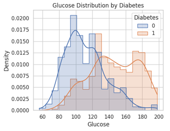
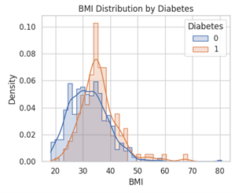
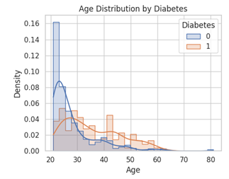

# Healthcare Diabetes Dataset

ชุดข้อมูลนี้เกี่ยวกับปัจจัยสุขภาพของผู้ป่วยโรคเบาหวาน ที่จะนำมาใช้ในการวิเคราะห์ปัจจัยที่มีผลต่อการเกิดโรคเบาหวาน

ในแต่ละ row คือกลุ่มตัวอย่างผู้ที่เป็นและไม่เป็นโรคเบาหวาน  1 row 1 คน และมีคอลัมน์ดังนี้:

* Id ระบุข้อมูลแต่ละในแต่row

* Pregnancies ประวัติการตั้งครรภ์(จำนวนครั้งที่ตั้งครรภ์)

* Glucose ระดับน้ำตาลในเลือด
ภายหลังการดื่มน้ำเชื่อมกลูโคสประมาณ 2 ชั่วโมง
เพื่อวัดความสามารถในการจัดการน้ำตาลในเลือด(Oral Glucose Tolerance Test - OGTT) หน่วย: มิลลิกรัมต่อเดซิลิตร(mg/dL)

* BloodPressure ความดันโลหิตขณะหัวใจคลายตัว (Diastolic)
หน่วย: มิลลิเมตรปรอท(mm Hg)

* SkinThickness ความหนาของชั้นไขมันใต้ผิวหนังบริเวณต้นแขน (Triceps) หน่วย: มิลลิเมตร(mm)

* Insulin ระดับอินซูลินในเลือดที่วัดภายหลังการดื่มน้ำเชื่อมกลูโคสประมาณ 2 ชั่วโมง(ในการทดสอบ OGTT)
หน่วย: ไมโครยูนิตต่อมิลลิลิตร(mu U/ml) ค่าสูงขึ้นบ่งชี้ถึงภาวะดื้ออินซูลินที่รุนแรงขึ้นเรื่อยๆ

* BMI ดัชนีมวลกาย (น้ำหนักเป็น กก. / ส่วนสูงเป็น ม.^2)

* DiabetesPedigreeFunction: ฟังก์ชันลำดับเครือญาติโรคเบาหวาน สะท้อนความเสี่ยงทางพันธุกรรม ซึ่งเป็นคะแนนทางพันธุกรรมของโรคเบาหวาน

* Age อายุ (ปี)

* Outcome(Diabetes) การจำแนกประเภทของกลุ่มตัวอย่าง โดยที่1คือผู้ที่เป็นโรคเบาหวาน และ0 คือผู้ที่ไม่เป็นโรคเบาหวาน

### วัตถุประสงค์ 
เพื่อศึกษาปัจจัยที่มีผลต่อการเกิดโรคเบาหวานและทำนายโอกาสการเกิดโรคเบาหวาน

### ตัวแปรในชุดข้อมูล

| Attribute | Description |
|----------|-------------|
| Id | ระบุข้อมูลในแต่ละrow |
| Pregnancies | จำนวนครั้งที่ตั้งครรภ์ |
| Glucose | ระดับน้ำตาลในเลือด ภายหลังการดื่มน้ำเชื่อมกลูโคสประมาณ 2 ชั่วโมง (มิลลิกรัมต่อเดซิลิตร)  |
| BloodPressure | ความดันโลหิตขณะหัวใจคลายตัว (มิลลิเมตรปรอท) |
| SkinThickness | ความหนาของไขมันใต้ผิวหนัง (มิลลิเมตร) |
| Insulin | ระดับอินซูลินในเลือดที่วัดภายหลังการดื่มน้ำเชื่อมกลูโคสประมาณ 2 ชั่วโมง (ไมโครยูนิตต่อมิลลิลิตร) |
| BMI | ดัชนีมวลกาย (น้ำหนักเป็น กก. / ส่วนสูงเป็น ม.^2) |
| DiabetesPedigreeFunction | คะแนนความเสี่ยงเบาหวานจากพันธุกรรม |
| Age | อายุ (ปี) |
| Outcome | การจำแนกประเภทของกลุ่มตัวอย่าง โดยที่ 1 คือผู้ที่เป็นโรคเบาหวาน และ 0 คือผู้ที่ไม่เป็นโรคเบาหวาน |

---
## Exploratory Data Analysis (EDA)

1. ตรวจสอบโครงสร้างข้อมูลเบื้องต้น
ได้แก่ Data type ของตัวแปร, ค่า Missing / Null และข้อมูลซ้ำ (Duplicate records)

2. จัดการข้อมูลซ้ำ
โดยทำการลบแถวข้อมูลที่ซ้ำกันออก เพื่อไม่ให้เกิดความเอนเอียงในการวิเคราะห์

3. จัดการค่าที่ไม่สมเหตุสมผล (Invalid values)
ลบข้อมูลแถวที่มีค่า Insulin = 0 ซึ่งไม่สอดคล้องกับสภาพความเป็นจริงทางการแพทย์

4. จัดการค่า 0 ในตัวแปรเชิงต่อเนื่อง
สำหรับตัวแปร Glucose, BloodPressure, SkinThickness และ BMI
ทำการแทนค่าที่เป็น 0 ด้วย ค่ามัธยฐาน (Median)
โดยคำนวณแยกตามกลุ่ม Diabetes (เป็น / ไม่เป็นโรคเบาหวาน) เพื่อรักษาโครงสร้างข้อมูลของแต่ละกลุ่ม

### การกระจายกลุ่มผู้ป่วย
ผู้ที่ไม่เป็นเบาหวาน (Diabetes = 0) : 971 คน (68%)  
ผู้ที่เป็นเบาหวาน (Diabetes = 1) : 467 คน (32%)

---

### ระดับน้ำตาลในเลือด (Glucose)
ผู้ที่เป็นเบาหวาน มีระดับน้ำตาลสูงกว่ากลุ่มไม่เป็นเบาหวานอย่างชัดเจน
ระดับน้ำตาลในเลือดเป็นตัวแปรที่มีความสัมพันธ์กับการเกิดโรคเบาหวานอย่างชัดเจน โดยกลุ่มที่ถูกวินิจฉัยว่าเป็นเบาหวานมีค่าเฉลี่ยระดับน้ำตาลในเลือดสูงกว่ากลุ่มที่ไม่เป็นอย่างเห็นได้ชัด สะท้อนให้เห็นว่าระดับกลูโคสเป็นปัจจัยสำคัญในการคัดกรองความเสี่ยงโรคเบาหวาน

---

### ดัชนีมวลกาย (BMI)
กลุ่มเบาหวานมี BMI สูงกว่ากลุ่มไม่เป็นเบาหวาน พบว่ากลุ่มผู้ป่วยเบาหวานมีค่า BMI สูงกว่ากลุ่มที่ไม่เป็นเบาหวานโดยเฉลี่ย แสดงให้เห็นว่าภาวะน้ำหนักเกินและโรคอ้วนมีความเชื่อมโยงกับความเสี่ยงในการเกิดโรคเบาหวาน

---

### อายุ (Age)
ผู้ที่มีอายุมากขึ้นมีโอกาสเป็นโรคเบาหวานเพิ่มสูงขึ้น โดยเฉพาะในช่วงวัยกลางคนถึงสูงอายุ ซึ่งอาจเกี่ยวข้องกับการเปลี่ยนแปลงของระบบเผาผลาญและพฤติกรรมด้านสุขภาพ

---

ปัจจัยที่มีอิทธิพลต่อการเกิดโรคเบาหวานมากที่สุดจากชุดข้อมูลนี้ ได้แก่
ระดับน้ำตาลในเลือด (Glucose), ดัชนีมวลกาย (BMI) และอายุ (Age) โดยผู้ที่เป็นเบาหวานมีระดับน้ำตาลในเลือด (Glucose) เฉลี่ยที่ 145.66 mg/dL ดัชนีมวลกาย (BMI) เฉลี่ยที่ 35.816060 และมีอายุ (Age) เฉลี่ยที่ 35
ซึ่งสามารถนำไปใช้เป็นข้อมูลพื้นฐานในการเฝ้าระวัง วางแผนด้านสาธารณสุข หรือพัฒนาโมเดลทำนายความเสี่ยงโรคเบาหวานในอนาคตได้

