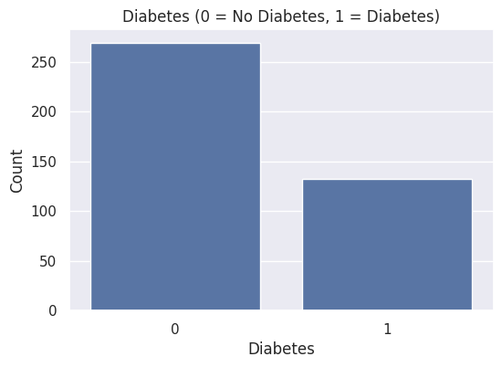
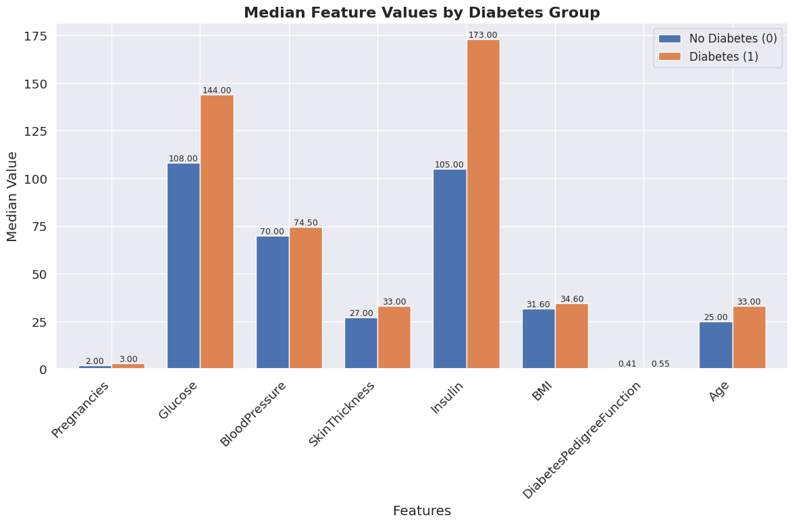
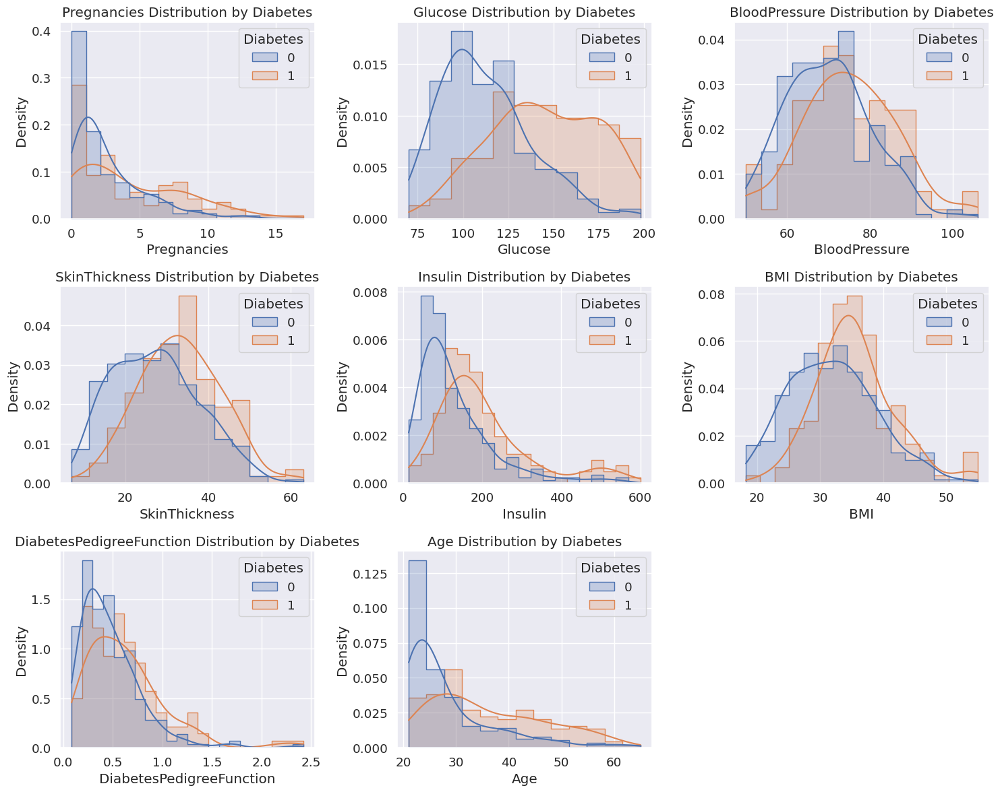
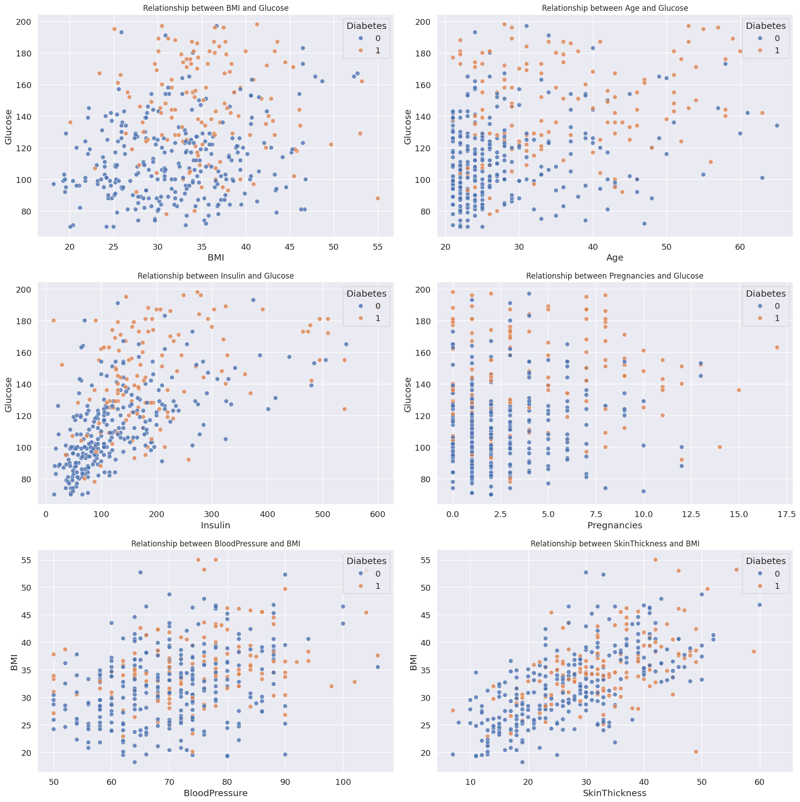
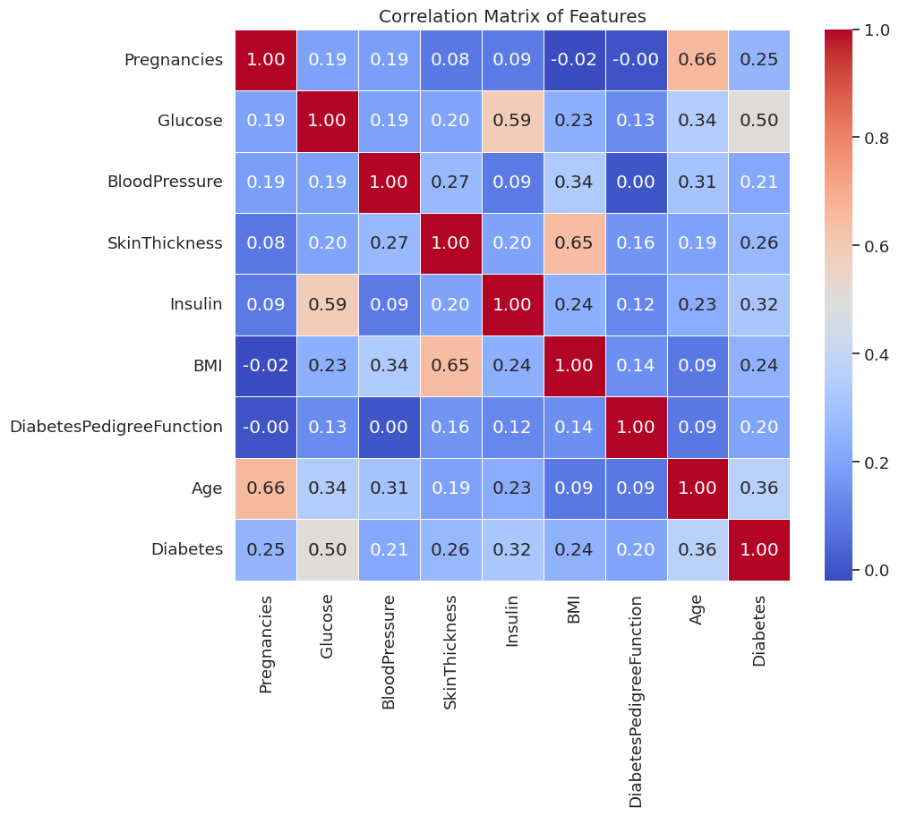

# 🩺 Healthcare Diabetes Dataset

ชุดข้อมูลนี้เกี่ยวกับปัจจัยสุขภาพของผู้ป่วยโรคเบาหวาน ที่จะนำมาใช้ในการวิเคราะห์ปัจจัยที่มีผลต่อการเกิดโรคเบาหวาน

##  Data Dictionary

| Attribute | Description | Data Type | Valid Range / Example |
|---------|------------|-----------|----------------------|
| **Id** | รหัสระบุข้อมูลแต่ละแถว | Nominal | 1, 2, 3, … |
| **Pregnancies** | จำนวนครั้งที่เคยตั้งครรภ์ | Ratio (Discrete) | [0, ∞) |
| **Glucose** | ระดับน้ำตาลกลูโคสในเลือดหลังการทดสอบดื่มน้ำตาล (OGTT) ประมาณ 2 ชั่วโมง หน่วย: มิลลิกรัมต่อเดซิลิตร | Ratio (Continuous) | [0, ∞) |
| **BloodPressure** | ความดันโลหิตขณะหัวใจคลายตัว (Diastolic) หน่วย: มิลลิเมตรปรอท (ค่าปกติ < 80 มิลลิเมตรปรอท) | Ratio (Continuous) | [0, ∞) |
| **SkinThickness** | ความหนาของชั้นไขมันใต้ผิวหนังบริเวณต้นแขน (Triceps) หน่วย: มิลลิเมตร | Ratio (Continuous) | [0, ∞) |
| **Insulin** | ระดับอินซูลินในเลือดหลังการทดสอบ OGTT ประมาณ 2 ชั่วโมง หน่วย: ไมโครยูนิตต่อมิลลิลิตร ค่าสูงบ่งชี้ถึงภาวะดื้ออินซูลิน | Ratio (Continuous) | [0, ∞) |
| **BMI** | ดัชนีมวลกาย (น้ำหนักเป็นกิโลกรัม ÷ ส่วนสูงเป็นเมตร²) | Ratio (Continuous) | [0, ∞) |
| **DiabetesPedigreeFunction** | ค่าคะแนนความเสี่ยงทางพันธุกรรมของโรคเบาหวานจากประวัติครอบครัว | Ratio (Continuous) | [0, ∞) |
| **Age** | อายุของกลุ่มตัวอย่าง (ปี) | Ratio (Discrete) | [0, ∞) |
| **Outcome** | สถานะการเป็นโรคเบาหวานของกลุ่มตัวอย่าง | Binary | 1 = เป็นโรคเบาหวาน, 
0 = ไม่เป็นโรคเบาหวาน |

## 🧹 Data Cleansing

1. ตรวจสอบโครงสร้างข้อมูลเบื้องต้น
ได้แก่ Data type ของตัวแปร, ค่า Missing / Null และข้อมูลซ้ำ (Duplicate records)

2. จัดการข้อมูลซ้ำ
โดยทำการลบแถวข้อมูลที่ซ้ำกันออก เพื่อไม่ให้เกิดความเอนเอียงในการวิเคราะห์

3. จัดการค่าที่ไม่สมเหตุสมผล (Invalid values)
ลบข้อมูลแถวที่มีค่า Insulin = 0 ซึ่งไม่สอดคล้องกับสภาพความเป็นจริงทางการแพทย์

4. จัดการค่า 0 ในตัวแปรเชิงต่อเนื่อง
สำหรับตัวแปร Glucose, BloodPressure, SkinThickness และ BMI
ทำการแทนค่าที่เป็น 0 ด้วย ค่ามัธยฐาน (Median)
โดยคำนวณแยกตามกลุ่ม Diabetes (เป็น / ไม่เป็นโรคเบาหวาน) เพื่อรักษาโครงสร้างข้อมูลของแต่ละกลุ่ม

## 📊 Analytics Methodology
- Exploratory Data Analysis (EDA) เพื่อวิเคราะห์การกระจายตัวของข้อมูลและความแตกต่างระหว่างผู้ที่เป็นและไม่เป็นโรคเบาหวาน
- Comparative Analysis เปรียบเทียบค่ามัธยฐานของตัวแปรสำคัญ เช่น Glucose, BMI, Age และ Insulin
- Correlation Analysis เพื่อศึกษาความสัมพันธ์ระหว่างตัวแปรสุขภาพกับการเกิดโรคเบาหวาน
- Visualization Analysis (Boxplot, Histogram, Scatter Plot) เพื่อระบุแนวโน้มและปัจจัยเสี่ยง

## 📈 กราฟแสดงจำนวนผู้ที่เป็นเป็นโรคเบาหวานและไม่เป็นเบาหวาน

กลุ่มตัวอย่างทั้งหมด 401 คน พบว่า
- ผู้ที่ไม่เป็นโรคเบาหวาน (Diabetes = 0) มีจำนวน 269 คน คิดเป็น 67% ของข้อมูลทั้งหมด
- ผู้ที่เป็นโรคเบาหวาน (Diabetes = 1) มีจำนวน 132 คน คิดเป็น 33% ของข้อมูลทั้งหมด

## 📈 กราฟแสดงการเปรียบเทียบค่ามัธยฐาน (Median) ของแต่ละ feature

เปรียบเทียบค่ามัธยฐาน (Median) ของแต่ละ feature โดยแบ่งตามกลุ่มตัวอย่าง Diabetes

- ผู้ที่เป็นโรคเบาหวานมีค่าระดับน้ำตาล (Glucose), อายุ (Age) และระดับอินซูลิน (Insulin) สูงกว่าอย่างชัดเจน โดยระดับอินซูลินที่สูงกว่ามาก แสดงถึงภาวะดื้อต่ออินซูลิน

- ผู้ที่เป็นโรคเบาหวานมีค่าความหนาของชั้นไขมันใต้ผิวหนัง (SkinThickness) และดัชนีมวลกาย (BMI) สูงกว่า สะท้อนถึงภาวะน้ำหนักเกินหรืออ้วน

- จำนวนการตั้งครรภ์ (Pregnancies) ความดันโลหิต (BloodPressure) และความเสี่ยงทางพันธุกรรม (Diabetes Pedigree Function) มีค่าแตกต่างกันเพียงเล็กน้อย โดยรวมแล้วค่าตัวแปรที่สูง มีโอกาสเพิ่มความเสี่ยงในการเป็นโรคเบาหวานมากขึ้น

## 📈 กราฟแสดงการกระจายตัวข้อมูลแต่ละ feature โดยแบ่งตามกลุ่มตัวอย่าง Diabetes

- ตัวแปร Glucose ผู้ที่เป็นเบาหวานมีระดับน้ำตาลในเลือดสูงกว่าผู้ที่ไม่เป็นเบาหวานอย่างมาก และการกระจายตัวของทั้งสองกลุ่มมีการซ้อนทับกันน้อยที่สุด ระดับน้ำตาลGlucose เป็นตัวบ่งชี้ความเสี่ยงการเป็นโรคเบาหวานได้ชัดเจน
- ตัวแปร BMI ผู้ที่เป็นโรคเบาหวานมีแนวโน้มที่จะมีค่า BMI สูงกว่าผู้ที่ไม่เป็นโรคเบาหวาน แสดงว่าค่า BMI ที่สูง(ภาวะอ้วน) มีความสัมพันธ์กับการเป็นโรคเบาหวาน
- ตัวแปร Age ผู้ที่เป็นโรคเบาหวานโดยเฉลี่ยมีอายุมากกว่า และมีการกระจายตัวของอายุที่กว้างกว่า บ่งชี้ว่า อายุที่มากขึ้นเพิ่มความเสี่ยงการเป็นโรคเบาหวาน
- ตัวแปร BloodPressure และ SkinThickness รูปกราฟมีการซ้อนทับกันเกือบสมบูรณ์ แสดงว่าความดันโลหิตและความหนาของผิวหนังในผู้ที่เป็นโรคเบาหวานและไม่เป็นโรคเบาหวาน มีค่าเฉลี่ยและรูปแบบการกระจายตัวที่ใกล้เคียงกัน แสดงว่ามีความสัมพันธ์กับการเป็นโรคเบาหวานน้อย
- ตัวแปร DiabetesPedigreeFunction ผู้ที่เป็นโรคเบาหวานมีค่าสูงกว่าเล็กน้อย แสดงว่าความเสี่ยงทางพันธุกรรมที่สูงขึ้นสัมพันธ์กับการเป็นโรคเบาหวาน
- ตัวแปร Insulin ผู้ที่เป็นโรคเบาหวานมีค่าสูงกว่าในบางช่วง โดยค่าสูงขึ้นบ่งชี้ถึงภาวะดื้อต่ออินซูลินที่รุนแรงขึ้นเรื่อยๆ ขณะที่ผู้ที่ไม่เป็นโรคเบาหวาน แต่ยังไม่ได้รับการวินิจฉัยว่าเป็นโรคเบาหวาน อาจมีค่าอินซูลินที่สูงได้

## 📈 Scatter Plot ดูคู่ความสัมพันธ์

## 📈 กราฟ Correlation Matrix (Heatmap) ดูความสัมพันธ์ของตัวแปร

---

### 🔍 Findings 

1. 🩸 **ระดับน้ำตาลในเลือด (Glucose)**  
   ผู้ที่เป็นโรคเบาหวานมีค่ามัธยฐานของ Glucose สูงกว่าผู้ที่ไม่เป็นโรคเบาหวานอย่างมีนัยสำคัญ  
   โดยการกระจายตัวของข้อมูลทั้งสองกลุ่มมีการซ้อนทับกันน้อยที่สุด และมีค่าสหสัมพันธ์กับการเกิดโรคเบาหวานสูงที่สุด  
   *(Correlation = 0.50)*

2. 📈 **อายุ (Age) และดัชนีมวลกาย (BMI)**  
   กลุ่มผู้ป่วยเบาหวานมีค่ามัธยฐานของ Age และ BMI สูงกว่ากลุ่มที่ไม่เป็นเบาหวานอย่างชัดเจน  
   สะท้อนว่าอายุที่เพิ่มขึ้นและภาวะน้ำหนักเกินหรือโรคอ้วน มีความเกี่ยวข้องกับความเสี่ยงของโรคเบาหวาน

3. 💉 **ระดับอินซูลิน (Insulin)**  
   พบระดับอินซูลินที่สูงได้ทั้งในผู้ที่เป็นโรคเบาหวานและผู้ที่ยังไม่ได้รับการวินิจฉัย  
   อย่างไรก็ตาม ผู้ที่เป็นโรคเบาหวานมีค่ามัธยฐานของ Insulin สูงกว่า ซึ่งบ่งชี้ถึงภาวะดื้อต่ออินซูลิน

4. 🔗 **ความสัมพันธ์ระหว่าง Glucose และ Insulin**  
   ระดับน้ำตาลในเลือด (Glucose) และระดับอินซูลิน (Insulin) มีความสัมพันธ์ในทิศทางเดียวกัน  
   *(Correlation = 0.59)*
   
5. ⚖️ **ตัวแปรที่มีความแตกต่างต่ำระหว่างกลุ่ม**  
   BloodPressure, SkinThickness และ DiabetesPedigreeFunction มีค่ามัธยฐานใกล้เคียงกัน  
   และกราฟการกระจายตัวมีการซ้อนทับกันสูง แสดงว่ามีความสัมพันธ์กับการเกิดโรคเบาหวานในระดับต่ำ

6. 🤰 **การตั้งครรภ์ (Pregnancies)**  
   Pregnancies มีความสัมพันธ์กับการเกิดโรคเบาหวานในระดับอ่อน *(Correlation = 0.25)*  
   แต่มีความสัมพันธ์กับอายุในระดับสูง *(Correlation = 0.66)*  
   โดยแนวโน้มค่าที่สูงขึ้นพบได้มากในกลุ่มผู้ที่เป็นโรคเบาหวาน

### 💡 Insights 

1. 🧠 **Glucose เป็นตัวชี้วัดหลัก**  
   ระดับน้ำตาลในเลือด (Glucose) เป็นตัวชี้วัดที่เชื่อถือได้มากที่สุดในการจำแนกการเป็นโรคเบาหวาน

2. 👵⚖️ **Age และ BMI เพิ่มความเสี่ยงโรคเบาหวาน**  
   อายุที่มากขึ้นและภาวะน้ำหนักเกินหรือโรคอ้วน เป็นปัจจัยสำคัญที่เพิ่มโอกาสการเกิดโรคเบาหวาน

3. 🔍 **ควรพิจารณา Glucose ร่วมกับ Insulin**  
   การใช้ข้อมูลระดับน้ำตาลในเลือด (Glucose) ควบคู่กับระดับอินซูลิน (Insulin)  
   ช่วยให้การประเมินความเสี่ยงการเป็นโรคเบาหวานมีความแม่นยำมากขึ้น

4. 📊 **ตัวแปรบางรายการไม่เหมาะใช้เดี่ยว ๆ**  
   BloodPressure, SkinThickness, DiabetesPedigreeFunction และ Pregnancies  
   ไม่สามารถใช้จำแนกการเป็นโรคเบาหวานแบบตัวแปรเดียวได้  
   จึงควรใช้ร่วมกับปัจจัยอื่นในการวิเคราะห์
   
6. ✅ **สรุปปัจจัยที่มีผลต่อการเกิดโรคเบาหวาน**

   - **ปัจจัยหลัก:**  
     Glucose, Insulin, BMI, Age  

   - **ปัจจัยร่วม:**  
    Pregnancies, DiabetesPedigreeFunction, BloodPressure, SkinThickness  

   โดยรวมแล้ว ตัวแปรที่มีค่ามากขึ้นมีแนวโน้มเพิ่มความเสี่ยงในการเป็นโรคเบาหวาน

